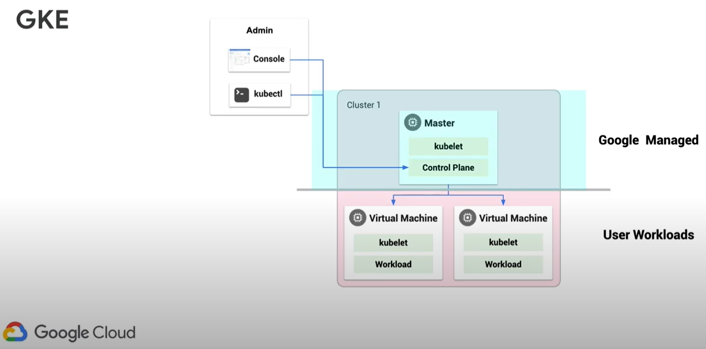

# Anthos

Modernize existing applications and build cloud-native apps anywhere to promote agility and cost savings.

## GKE

Google Kubernetes Engine

Sits on top of VMWare VSphere in your environment

## Comparison of GKE, GKE on Prem, Kubernetes (K8s)

Differences between GKE, GKE on Prem and the open source Kubernetes.

These are container orchestration services and tools.

### Kubernetes

### GKE

### GKE on Prem

## GKE Hub

Automatically registers On-Prem clusters upon creation

Allows customers to interact with their On-Prem workloads from the Cloud Console

GKE on Prem makes an outbound TLS to Google Cloud Platorm

Overview

## Istio Service Mesh

Benefits

Enabling Technology

Inserts a network proxy within the pod which captures inbound and outbound network connectivity.

Service Architecture

The proxy architecture allows for:

- Traffic encryption
- Enforce access policies on per pod basis, for example by limiting access of the Pictures pod only from the Frontend pod.

## References

- [Anthos](https://cloud.google.com/anthos)
- [An introduction to Anthos (Google Cloud Community Day ‘19)](https://youtu.be/42RmVrM7B7E)